# Trabajo Práctico N° 3.    
## Grupo 24
## Integrantes
- Carlos Arce
- Jerónimo Baltian Ortiz
- Gianfranco Campagnucci
- Dario Colantonio 

## Indice

- [Introduction](#introduction)
- [API: Conceptos del desarrollo](#api-conceptos-del-desarrollo)
- [API: Sistema](#api-sistema)
- [API: Endpoints](#api-endpoints)
- [Render HTM: Conceptos del desarrollo](#render-html-conceptos-del-desarrollo)
- [Render HTML: Sistema](#render-html-sistema)
- [Render HTML: Endpoints](#render-html-endpoints)

## Introduction

Este documento presenta un resumen conceptual del Trabajo Práctico N° 3 de Programación. 
El proyecto comprende dos elementos claramente definidos: 
- API Rest para gestionar los pacientes de una clínica, que devuelve la información en un formato JSON.
- Renderizado HTML de las consultas, que devuelve una visualizacion via un navegador web.  
- Ambos sistema permiten que se pueda visualizar listas o individuos, agregar, editar o eliminar.
- Ambos conceptos conforman sistemas CRUD plenamente funcionales.
- Ambos conceptos emplean un sistema JWD para impedir el acceso sin credenciales.
- Se validad el ingreso de las credenciales.
- Se editaron las carpetas para separar claramente ambos sistemas.
- Las rutas estan separadas por sistemas.
- Se da seguridad de respuesta a la posibilidad de que se ingresen enlaces sin ruta.
- [~volver al indice~](#indice)

### Arranque del sitio 

El sitio, descargado desde github y ejecutado en VSCODE, Windows 11, inicia con el comando npm run dev. 
Ejecutado en Ubuntu / Linux, posiblemente requiera reinstalar las dependencias del package.json. 

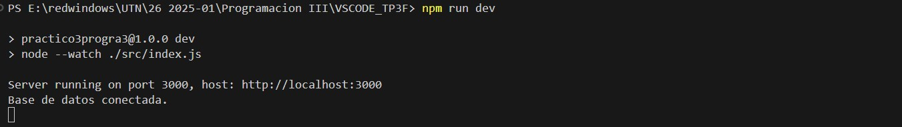 

### API: Conceptos del desarrollo 

Para el desarrollo del segmento API del proyecto, se asumieron las siguientes nociones:

- Que se debe obtener un sistema CRUD completo y funcional.
- Que la herramienta de prueba es Postman.
- Que la API se encuentra en desarrollo.
- Que por el momento, solo se desea verificar el funcionamiento de las rutas y del controlador.
- Que la base de datos no fue definida, por lo cual se emplea un mock para la misma.
- Que el diseño no se va a apartar fundamentalmente del diseño provisto.
- Que se debe incorporar la posibilidad de consultar por id, o sea por paciente.
- [~volver al indice~](#indice)

### API: Sistema

En consecuencia, se tiene un sistema que presenta las siguientes características:

- Emplea la clase provista, class Paciente.
- Emplea la instancia provista, con las credenciales "email@gmail.com" "12345".
- Emplea un login con las credenciales indicadas y recibe un token en respuesta.
- Emplea el token para el resto de los request dirigidos al servidor.
- Permite consultar por lista.
- Permite consultar por id
- Permite modificar los datos cargados, por id.
- Permite borrar por id.
- [~volver al indice~](#indice)

### API: Endpoints

- POST http://localhost:3000/api/v1/pacientes/login  - Acceso para obtener el token

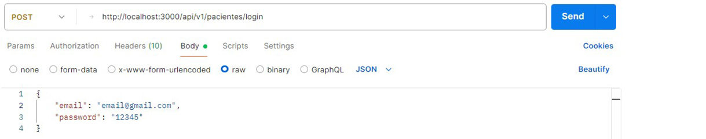 

- GET http://localhost:3000/api/v1/pacientes     - Consulta GET de la lista de pacientes

 

- GET http://localhost:3000/api/v1/pacientes/1 - Consulta GET de un paciente por su id

 

- POST http://localhost:3000/api/v1/pacientes - Creacion de un nuevo paciente

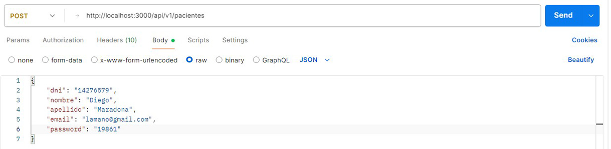 

- PUT http://localhost:3000/api/v1/pacientes - Modificacion de los datos existente

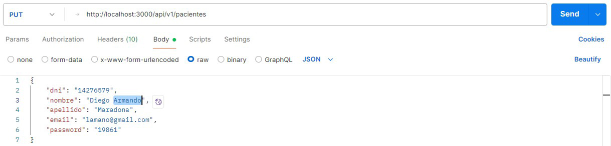 

- DELETE http://localhost:3000/api/v1/pacientes/1 - Borrado de un paciente

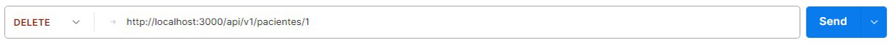 

- [~volver al indice~](#indice)    

### Render HTML, conceptos del desarrollo

El renderizado html se desarrolló bajo las siguientes premisas:

- Que se debe obtener un sistema CRUD completo y funcional.
- Que la direccion de acceso es http://localhost:3000 via un un navegador web.
- Que la base de datos es de tipo persistente, sqlite.
- Que el diseño no se va a apartar fundamentalmente del diseño provisto.
- Que se debe controlar la validez de los datos proporcionados al ingresar.
- Que se debe controlar la validez de los indices usados en el CRUD.
- [~volver al indice~](#indice)

### Render HTML: Sistema

En consecuencia, se tiene un sistema que presenta las siguientes características:

- Guarda los datos en la base de datos clinica.sqlite.
- Se puede ingresar con las credenciales "email@gmail.com" "12345678".
- Emplea un login con las credenciales indicadas y recibe un token en respuesta.
- El token se almacena por medio de una cookie.
- Emplea el token para el resto de los request dirigidos al servidor.
- Permite consultar por lista.
- Permite consultar por id
- Permite modificar los datos cargados, por id.
- Permite crear un paciente.
- Permite borrar un paciente.
- Realiza validacion en servidor, del email y del tamaño del password.
- Permite cerrar sesión, borrando la cookie.
- [~volver al indice~](#indice)

### Render HTML: Endpoints

http://localhost:3000/api/v1/pacientes/login  - Acceso para obtener el token 

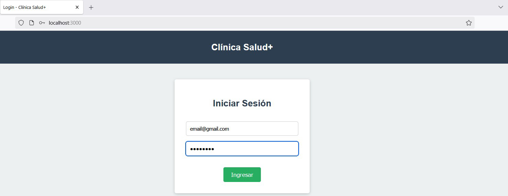   

http://localhost:3000/pacientes  - Lista de pacientes y acceso a la edición individual de cada paciente.

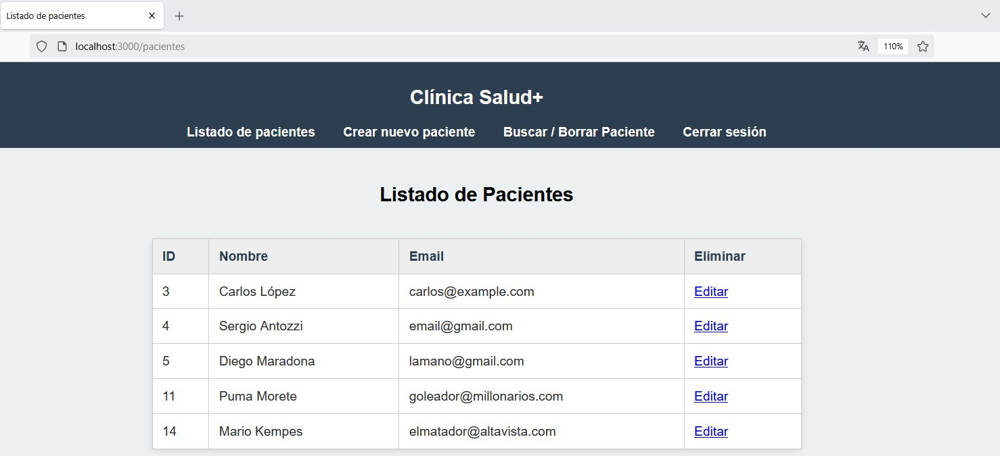   

http://localhost:3000/pacientes/create  - Crear un nuevo paciente.

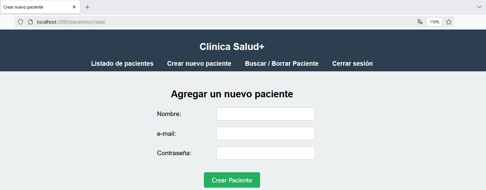   

http://localhost:3000/pacientes/id/edit  - Editar un paciente. (Falta el id del paciente)

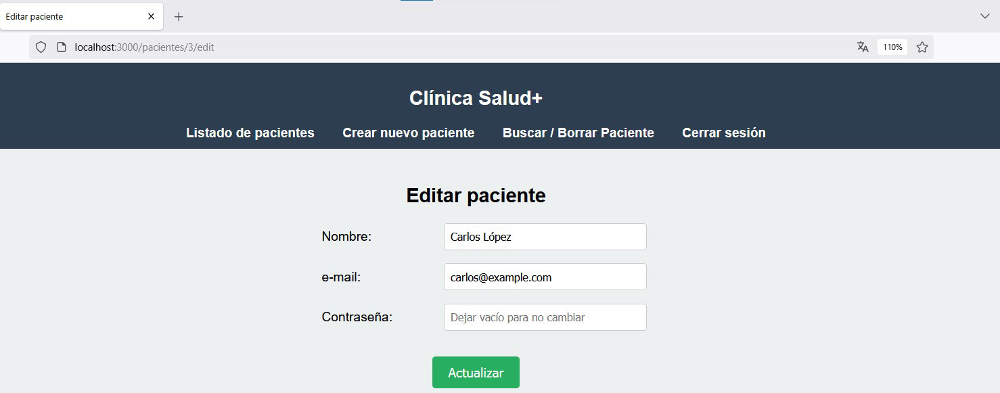   

http://localhost:3000/pacientes/search  - Busqueda de un paciente dado, con la posibilidad de eliminarlo

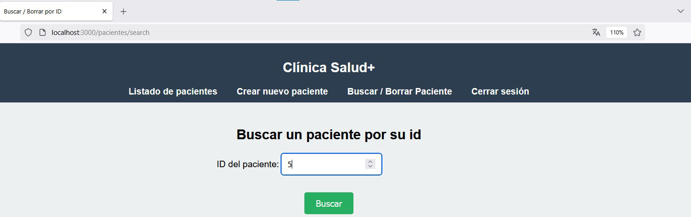   

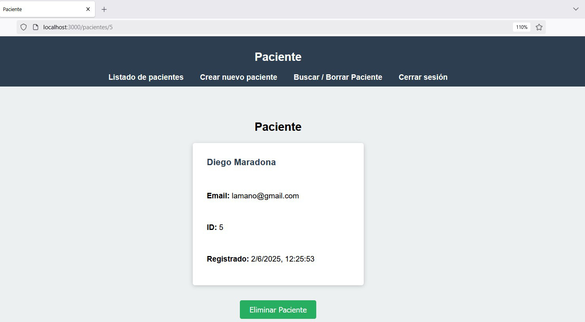   

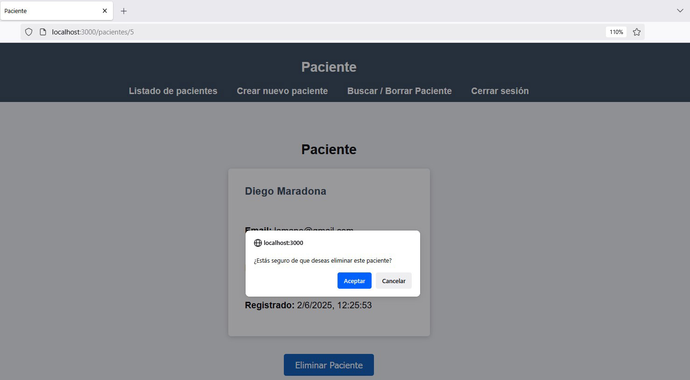   

http://localhost:3000/pacientes/paginafalsa  - Error 404. Página no existente.

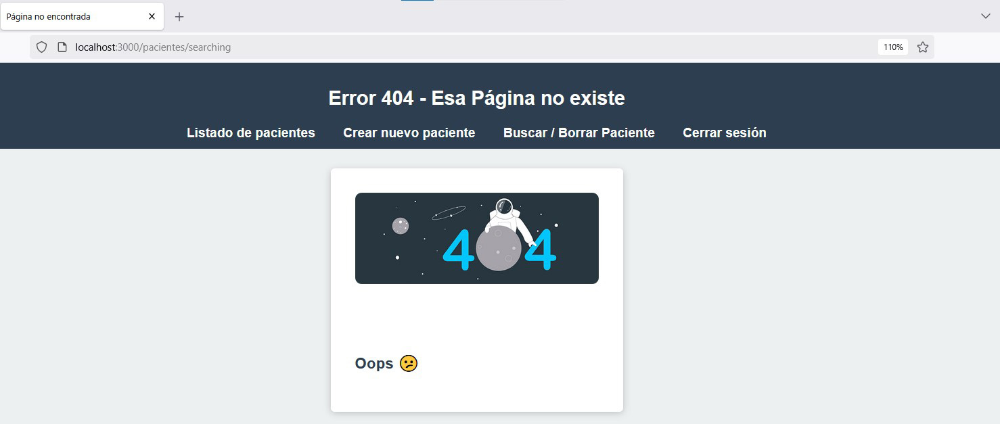   

- [~volver al indice~](#indice)